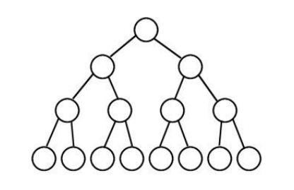

### Problema A

# Árvore Binária

Uma árvore é um conjunto de nós conectados de tal forma que haja exatamente um único caminho entre dois nós distintos. Para cada par de nós conectados, é dito que um é pai de outro. Toda árvore possui um único nó sem pai. Este nó é chamado de raiz. Os nós de uma árvore que não possuem filhos são chamados de folhas. 

Árvore binária é aquela que cada nó possui no máximo dois filhos. Uma árvore binária é dita cheia se todos os nós que não forem folhas tiverem exatamente dois filhos. A altura de uma árvore binária é quantidade de nós entre a folha mais distante da raiz e a raiz mais um (em uma árvore binária cheia, todas as folhas têm a mesma quantidade de nós até a raiz). A altura da árvore binária abaixo é 3.

Dada a altura de uma árvore binária cheia, sua a tarefa é determinar o número de nós dessa árvore.

## Entrada

A primeira linha da entrada contém um inteiro N (1 ≤ N ≤ 10) indicando a quantidade de casos de teste. Cada caso de teste é composto por um inteiro H (0 ≤ H ≤ 50) indicando a altura da árvore binária cheia.

## Saída

Para cada caso de teste, imprima uma linha contendo a quantidade de nós da árvore binária cheia.

## Exemplos de Entrada e Saída

| Exemplo de Entrada  | Exemplo de Saída |
| ------------- | ------------- |
| 3 | 3 |
| 1 | 7 |
| 2 | 15 |
| 3 ||
